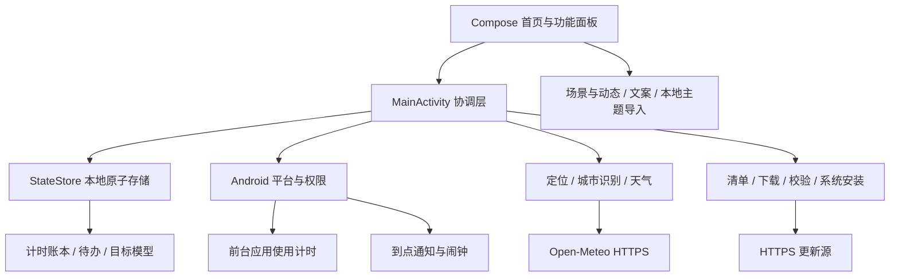

# 源码结构

[构建指南](../BUILDING.md) · [首页](../README.md)

禅使用原生 Kotlin、Jetpack Compose 和 Android 平台能力，业务界面不依赖 WebView。项目只有 `android/app` 一个应用模块，入口为 `MainActivity`。

| 路径（相对 android/app/src/main） | 职责 |
| --- | --- |
| `java/dev/zen/launcher/MainActivity.kt` | 生命周期、界面状态与操作协调 |
| `ZenUi.kt`、`ZenPanel.kt`、`Panels.kt` | 首页、面板导航与设置入口 |
| `Models.kt`、`StateStore.kt` | 计时结算、日期归属、数据模型与原子保存 |
| `Platform.kt`、`UsageMonitorService.kt` | 权限、前台事件、提醒与服务 |
| `LauncherGateway.kt`、`HomeRecovery.kt` | 应用目录、默认桌面及退出恢复 |
| `DailyToolsUi.kt`、`FocusFlow.kt`、`FocusStatistics.kt` | 待办、任务关联计时和统计 |
| `TodoOverlayService.kt`、`PriorityNotifications.kt` | 跨应用待办与禅内重点通知 |
| `AutomaticWeatherLocation.kt`、`CityNames.kt`、`WeatherClient.kt` | 前台定位、城市识别与天气刷新 |
| `AppUpdates.kt`、`UpdateProtocol.kt` | HTTPS 更新、版本／包名／签名／哈希校验 |
| `Scene.kt`、`SceneMotion.kt`、`ThemeCards.kt` | 场景、动态及本地主题导入解析 |
| `QuoteLibrary.kt`、`QuoteLibraryUi.kt` | 文案筛选、编辑、删除与恢复 |
| `assets/scenes`、`assets/motifs.json`、`assets/copy.json` | 六个内置主题的可编辑场景与短句 |
| `res/values*`、`res/font` | 界面语言资源与字体 |

表格中除第一行外，Kotlin 文件均位于同一 `java/dev/zen/launcher/` 包路径下。

个人记录保存在应用私有目录，不上传到天气或更新服务。应用提醒的前台用时与专注计时独立结算；专注累计只包括专注阶段。主题导入读取数据与图片，不执行外部代码。修改这些边界前，应同时检查 [隐私说明](../PRIVACY.md) 与用户手册。
