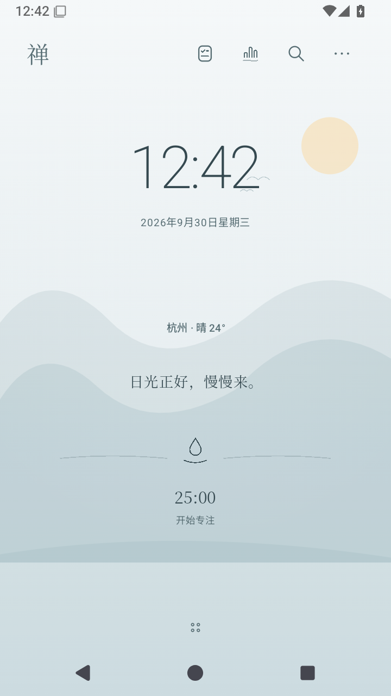
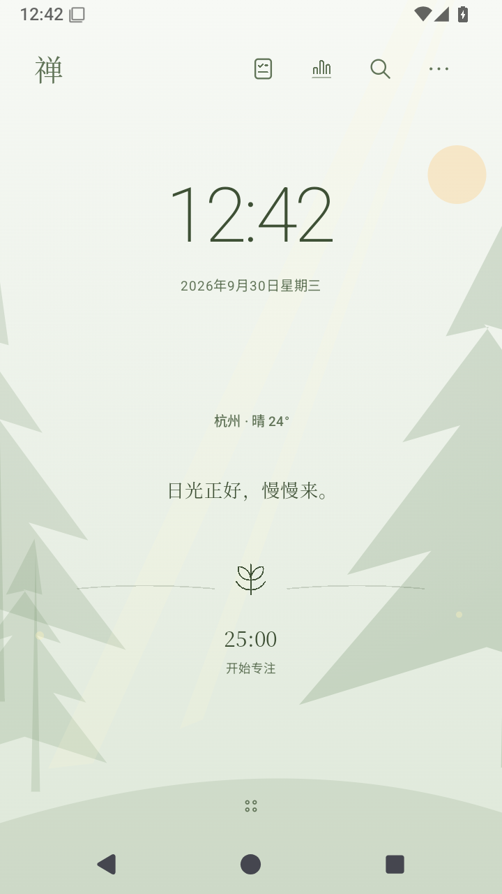
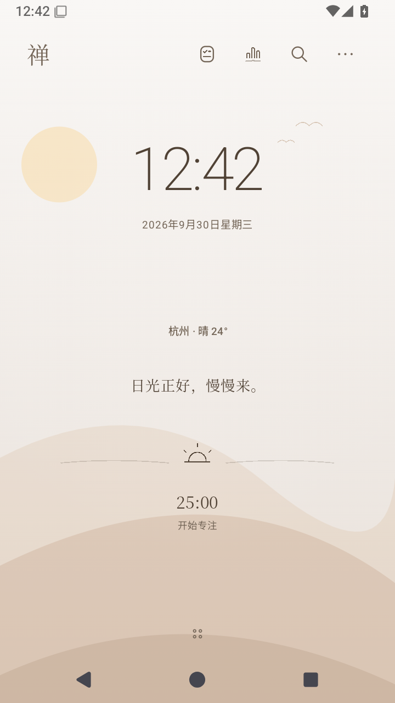
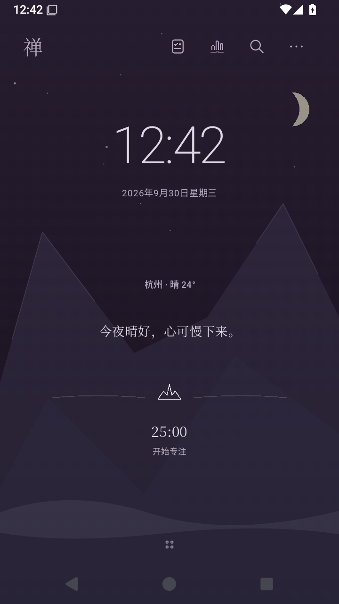
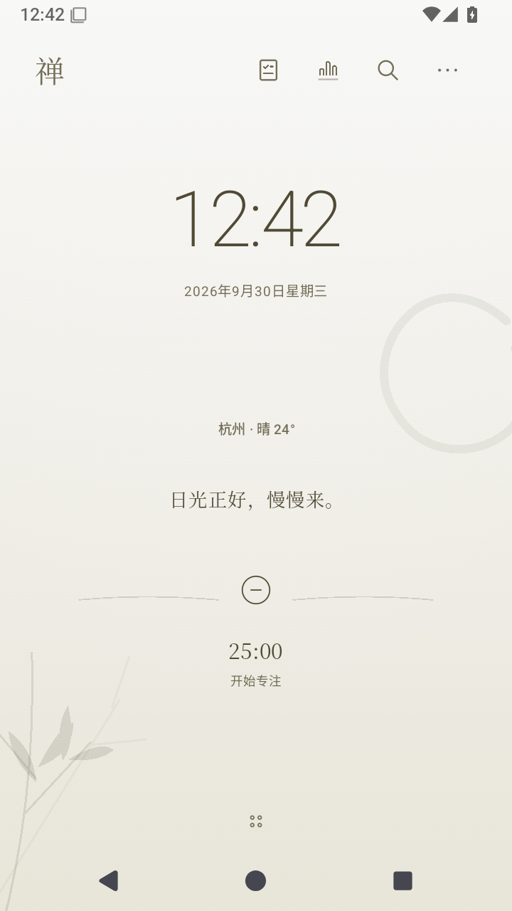
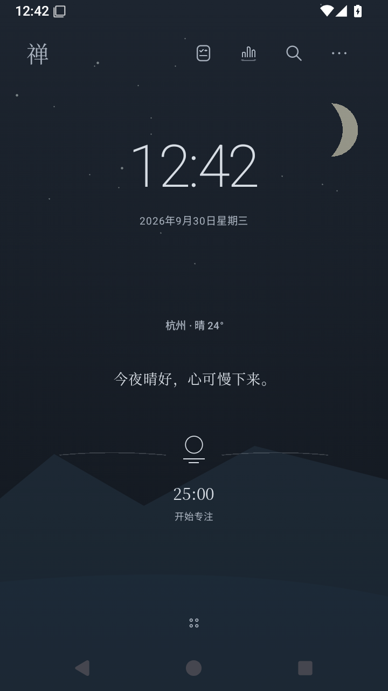

# 主题与文案

[首页](../README.md) · [使用手册](USER_GUIDE.md) · [问题排查](FAQ.md)

主题决定桌面的整体气氛，文字和控件也随之调整。你可以按喜欢的色调选择，再分别设置昼夜、动态与文案；计时、待办和记录不需要跟着重新配置。

## 六个内置主题

| 水静 · 雾蓝 | 松风 · 苔绿 | 晨曦 · 暖杏 |
| :---: | :---: | :---: |
|  |  |  |
| 浅色山水，留出开阔的空间 | 绿色层次，让桌面带一点自然气息 | 温暖明亮的色调 |

| 暮山 · 烟紫 | 月白 · 素纸 | 夜泊 · 深蓝 |
| :---: | :---: | :---: |
|  |  |  |
| 偏紫的山色，安静的明暗层次 | 接近纸面的素色与留白 | 深色背景，保留月色与山形 |

以上为 0.5.5 的真实应用截图，城市与天气是示例数据。静态图片用于比较构图和色调，不代表动画效果或实时天气。

## 选择主题与日夜模式

进入 **设置 → 主题** 选择主题。日夜可以跟随自动模式，也可手动查看白天或夜晚效果。自动模式下，可用的日出日落信息与时间共同参与昼夜判断；手动模式适合比较画面或固定喜欢的状态。

这里的“白天／夜晚”决定当前场景；文案管理里的时段筛选用于查看和编辑对应短句，单纯切换筛选不会把桌面强制变成夜景。

## 动态与省电

动态效果可在主题设置中关闭。如果打开动态后仍显示静态画面，先检查省电模式、系统省电状态以及专注时的简化状态。锁屏或离开桌面后，不需要为了看到效果而保持屏幕常亮。

**设置 → 省电模式** 会暂停背景动画，并把自动定位间隔调整为 15 分钟。计时和提醒继续运行；这减少的是禅自身的部分工作，目前没有整机续航提升的实测承诺。

## 一句文案如何出现在首页

文案按 **当前主题 → 白天／夜晚 → 天气 → 分类** 组织。分类有“风景”“专注”“休息”，在 **设置 → 文案设置 → 首页文案分类** 中选择。

轻点首页短句，可以在当前条件下换一句；长按查看出处。天气不可用时会使用相应的未知天气条件，不把缺少数据当成晴天。文字来源与用户编辑状态可以在出处或管理界面查看。

## 编辑自己的文案

1. 进入 **设置 → 文案设置 → 文案管理**。
2. 在顶部固定筛选区选主题、时段、天气和分类，再浏览下面的列表。
3. 点“编辑”修改已有短句，或点“添加”写一条新的。每条最多 160 字。
4. 保存前确认编辑框上方的条件。修改只作用于当前主题、时段、天气与分类，不会自动改写所有主题中的同一句话。

例如，想在“松风”的雨天白昼留下一句阅读提醒，应选择 **松风／白天／雨天对应分类／专注**，再添加文字。要让它在夜晚也出现，需要到夜晚条件下另行添加。

修改原文后会标记为“用户编辑”，不再当作未改动的原作引文。离开尚未保存的编辑时，界面会提示是否放弃修改。

### 删除、撤销与恢复

- 删除后可以使用当前界面的“已删除 · 撤销”。
- 顶部“查看已删除”用于找回当前筛选条件下移除的内容。
- 对内置文案可“恢复原文”；自定义文案使用“恢复”。
- 列表为空时，先核对筛选条件；它可能只表示这个组合尚无内容。

月份筛选只在具有季节性文案的主题中显示，并非所有主题都有该选项。

## 外部主题卡的发布范围

应用保留本地主题卡导入功能，但**本次仓库与 Release 不分发任何外部主题卡**，也不提供主题卡合集、额外原画或下载链接。安装包只含上面的六个内置主题。

导入能力和内容发布是两件事。自制素材应明确其来源及使用权限，不要把私人主题资源附到公开问题或文档中。
